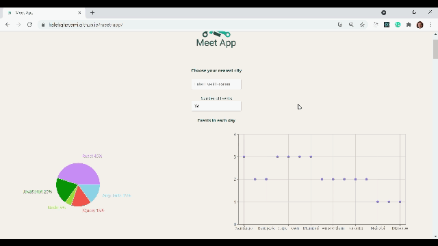

# Meet App

<p align="center">

 </p>

### Objective:

Meet App is a serverless, progressive web application (PWA) with React using a test-driven development (TDD) technique. The application uses the Google Calendar API to fetch upcoming events. The serverless function is hosted by the cloud provider AWS.

Meet App alows users to search for events hosted in a specified city. The user can view charts that display how many events will take place in that specified city as well the popularity of event genres in form of a pie chart.
<br><br>

### How To Use

- Go to this [homepage](https://halehghavami.github.io/meet-app/)
- Sign in with a Google Account

### Technologies

- Requires [Node.js](https://nodejs.org/en/) and [npm](https://www.npmjs.com)
- Written with [React](https://reactjs.org)
- TDD [Jest](https://jestjs.io)
- Serverless function [AWS-Lambda](https://aws.amazon.com/lambda/)
- API [Google Calendar](https://developers.google.com/calendar/)

<br><br>
Key Features:<br>

  <ul>
● Filter events by city.
  </ul>
  <ul>
● Show/hide event details.
  </ul>
  <ul>
● Specify number of events.
  </ul>
  <ul>
● Use the app when offline.
  </ul>
  <ul>
● Add an app shortcut to the home screen.
  </ul>
  <ul>
● View a chart showing the number of upcoming events by city.
  </ul>

### User stories and Gherkin syntax:

FEATURE 1: FILTER EVENTS BY CITY<br>
USER STORY FEATURE 1: As a user, I should be able to filter events by city, so that I can see what is happening where I am located.<br>

```
Scenario 1: When user hasn’t searched for a city, show upcoming events from all cities.

⦁	Given user hasn’t searched for any city
⦁	When the user opens the app
⦁	Then the user should see a list of all upcoming events.

```

```
Scenario 2: User should see a list of suggestions when they search for a city.


⦁	Given the main page is open
⦁	When user starts typing in the city textbox
⦁	Then the user should see a list of cities (suggestions) that match what they’ve typed.

```

```
Scenario 3: User can select a city from the suggested list.

⦁	Given the user was typing “Berlin” in the city textbox and the list of suggested cities is showing
⦁	When the user selects a city (e.g., “Berlin, Germany”) from the list
⦁	Then their city should be changed to that city (i.e., “Berlin, Germany”) and the user should receive
        a list of upcoming events in that city.
        And the list of suggestions should disappear.

```

FEATURE 2: SHOW/HIDE AN EVENT'S DETAILS<br>
USER STORY FEATURE 2: As a user, I should be able to show/hide an event's details, so that I can see what is exactly happening at each event.<br>

```
Scenario 1: An event element is collapsed by default.

⦁	Given the main page is open
⦁	When the app is rendered
⦁	Then the user should see a list of collapsed event elements.

```

```
Scenario 2: User can expand an event to see its details.

⦁	Given the list of upcoming events is displayed
⦁	When the user clicks `show details` button on the event element
⦁	Then the user should see expanded event element with its details

```

```
Scenario 3: User can collapse an event to hide its details.

⦁	Given the user has clicked `show details` on an event element
⦁	When the user clicks `hide details` on the event element
⦁	Then the event element will close and the user will see the list of collapsed event elements

```

FEATURE 3: SPECIFY NUMBER OF EVENTS<br>
USER STORY FEATURE 3: As a user, I should be able to change the number of events, so that I can choose the number of events to view at one time.<br>

```
Scenario 1: When user hasn’t specified a number, 32 is the default number.

⦁	Given the main page is open
⦁	When  the app is rendered
⦁	Then the app will display 32 events.

```

```
Scenario 2: User can change the number of events they want to see.

⦁	Given the list of upcoming events is displayed
⦁	When the user enters a number into the `number of events` input box
⦁	Then the user will see the number of events they specified.

```

FEATURE 4: USE THE APP WHEN OFFLINE<br>
USER STORY FEATURE 4: As a user, I should be able to use the app offline, so that I don’t need internet access to see the events I was viewing previously.<br>

```
Scenario 1: Show cached data when there’s no internet connection.

⦁	Given there is no internet connection
⦁	When the user opens the app
⦁	Then the app should show data that was loaded last.

```

```
Scenario 2: Show error when user changes the settings (city, time range).

⦁	Given there is no internet connection and the app is open
⦁	When the user tries changing settings (city, time range)
⦁	Then the app shows error message saying in order to change settings the user must reconnect to internet.

```

FEATURE 5: DATA VISUALIZATION<br>
USER STORY FEATURE 5: As a user, I should be able to view a chart of events in each city, so that I can see the number of upcoming events in each city.<br>

```
Scenario 1: Show a chart with the number of upcoming events in each city.

⦁	Given the user has selected to view events in a city
⦁	When the user clicks on that city's chart
⦁	Then the user should be able to see a graph or chart displaying the number of events in that city.

```
